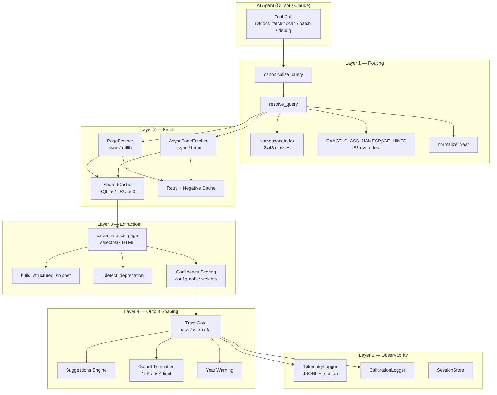
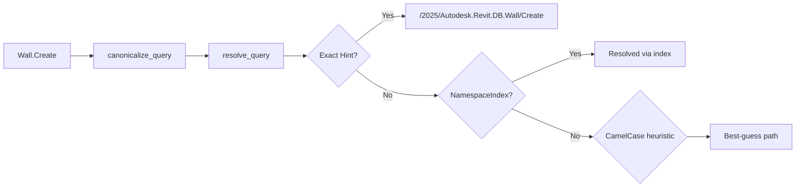
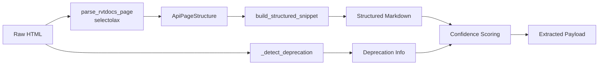
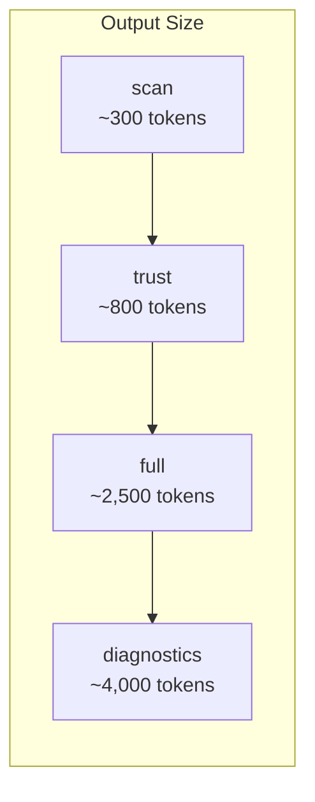
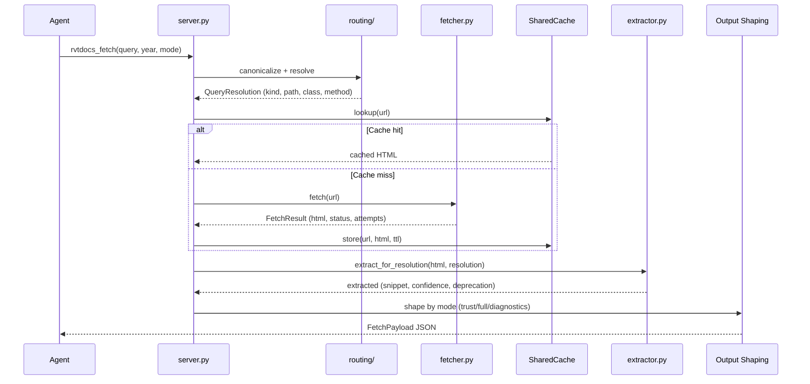

# Architecture

Internal architecture of `rvtdocs-mcp-py`, organized into five layers.

## Layer Diagram



## Layer Details

### Layer 1 — Routing (`routing/`)

Transforms a free-text query into a rvtdocs.com URL path.



| Component | File | Role |
|-----------|------|------|
| `canonicalize_query()` | `routing/__init__.py` | Strip whitespace, normalize casing, expand aliases |
| `resolve_query()` | `routing/resolver.py` | Match query to URL using priority chain |
| `NamespaceIndex` | `routing/namespace_index.py` | Lazy-loaded JSON index of 2,448 class-to-namespace mappings per year |
| `EXACT_CLASS_NAMESPACE_HINTS` | `routing/constants.py` | 85 hand-curated overrides for commonly misrouted classes |
| `normalize_year()` | `routing/resolver.py` | Validate year, clamp to supported range, emit warnings |
| `build_suggestions()` | `routing/suggestions.py` | Generate actionable suggestions for failed queries |

**Resolution priority chain:**
1. Exact namespace hint override (highest priority)
2. NamespaceIndex data-driven lookup (2,448 classes)
3. Method context namespace hints
4. CamelCase heuristic (lowest priority, fallback)

### Layer 2 — Fetch (`fetcher.py`, `async_fetcher.py`, `cache_store.py`)

HTTP retrieval with caching and retry logic.

| Component | Transport | Use Case |
|-----------|-----------|----------|
| `PageFetcher` | `urllib` (sync) | Single-query tools: `rvtdocs_fetch`, `rvtdocs_scan`, `rvtdocs_debug` |
| `AsyncPageFetcher` | `httpx` (async) | Batch tool: `rvtdocs_batch` (concurrent) |
| `SharedCache` | SQLite (WAL mode) | Shared by both fetchers, thread-safe via `threading.Lock` |

**Cache behavior:**

| Feature | Value |
|---------|-------|
| Backend | SQLite with WAL journal mode |
| Capacity | 500 entries, LRU eviction (batch of 100) |
| TTL — class/method | 7 days |
| TTL — namespace | 30 days |
| TTL — negative (failed fetch) | 30 seconds |
| Thread safety | `threading.Lock` around all DB operations |
| Migration | Auto-migrates legacy `cache.json` to SQLite on first access |

**Retry policy:**

```
Attempt 1 → fail → wait 1.0s → Attempt 2 → fail → wait 3.0s → Attempt 3 → give up
```

Returns `FetchResult` with `attempts_used`, `retries_used`, and `error_detail` for transparency.

### Layer 3 — Extraction (`extractor.py`, `html_parser.py`)

Transforms raw HTML into structured API documentation.



**Structured extraction output** (vs raw text):

| Aspect | Raw (trafilatura) | Structured (html_parser) |
|--------|-------------------|--------------------------|
| Format | Flat text dump | Section-aware markdown |
| Noise | Inherited members, nav, ads | Stripped to declared members only |
| Size | ~3,000 chars for a class page | ~2,000 chars (33% smaller) |
| Parseable | Agent must interpret | Ready-to-use sections |

**Confidence scoring** uses configurable weights (`confidence_config.py`) with signals:
- Title token match
- Class token match
- Method token match
- Structured parameters found
- Namespace match
- Deprecation detection

### Layer 4 — Output Shaping (`server.py`)

Controls what the agent receives, minimizing tokens while preserving actionable information.

**Trust-gate modes:**



| Mode | Snippet | Diagnostics | Evidence | TokenStats | Use Case |
|------|---------|-------------|----------|------------|----------|
| `scan` | No | No | No | No | Quick existence check |
| `trust` | No | No | No | No | Code generation with metadata only |
| `full` | Yes | No | Yes | Yes | Read API documentation in detail |
| `diagnostics` | Yes | Yes | Yes | Yes | Debug routing and extraction issues |

**Output truncation** enforces hard limits:

| Scope | Limit |
|-------|-------|
| Single tool | 15,000 chars |
| Batch tool | 50,000 chars |
| Truncation order | snippet → diagnostics → suggestions → error |

### Layer 5 — Observability (`telemetry.py`, `calibration.py`, `session_store.py`)

Fail-safe logging and session management.

| Component | Storage | Rotation | Purpose |
|-----------|---------|----------|---------|
| `TelemetryLogger` | JSONL file | 10 MB | Tool usage events (query, latency, cache hit, source) |
| `CalibrationLogger` | JSONL file | None | Confidence calibration data for tuning weights |
| `SessionStore` | In-memory dict | None (ephemeral) | Cross-tool key-value store for agent context |

## Data Flow — Single Fetch


