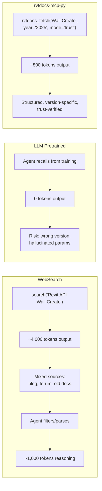
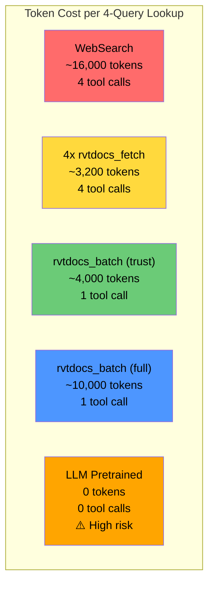
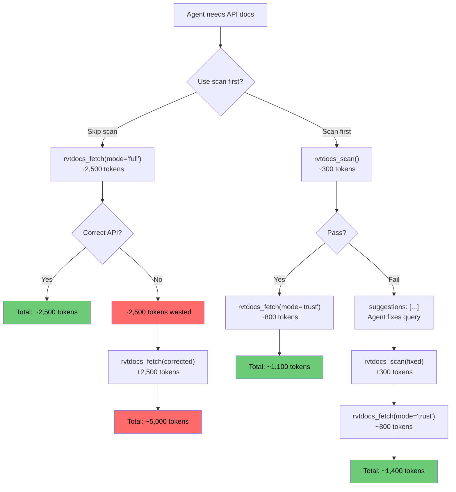
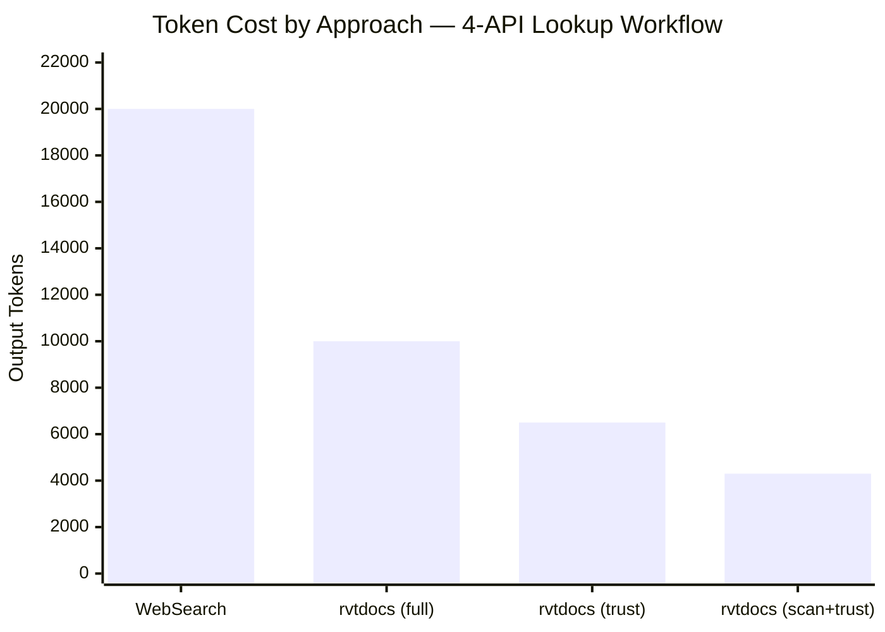

# Token Efficiency Analysis

Quantitative comparison of three approaches for Revit API documentation retrieval in agentic workflows.

## The Three Approaches

| Approach | Source | Version-aware | Structured | Verifiable |
|----------|--------|---------------|------------|------------|
| **WebSearch** (Bing/Google) | Mixed web results | No | No | Partially |
| **LLM Pretrained** | Training data | No | N/A | No |
| **rvtdocs-mcp-py** | rvtdocs.com (official) | Yes (2022-2027) | Yes | Yes (trust-gate) |

---

## Single Query Comparison

### Scenario: "Look up `Wall.Create` method for Revit 2025"



| Metric | WebSearch | LLM Pretrained | rvtdocs (trust) | rvtdocs (scan) |
|--------|-----------|----------------|-----------------|----------------|
| Output tokens | ~4,000 | 0 | **~800** | **~300** |
| Latency | 2-4s | 0s | 1-2s (miss) / <100ms (hit) | 1-2s (miss) / <100ms (hit) |
| Version accuracy | ~60% | ~40-70% | **~95%** | **~95%** |
| Structured output | No | N/A | Yes | Yes (metadata only) |
| Actionable on failure | No | N/A | Yes (suggestions) | Yes (suggestions) |
| Hallucination risk | Low | **High** | None | None |

---

## Batch Query Comparison

### Scenario: "Look up 4 related APIs for ExtensibleStorage implementation"

Queries: `ExtensibleStorage`, `SchemaBuilder`, `Entity.Set`, `FilteredElementCollector`

| Approach | Tool calls | Output tokens | Latency | Accuracy |
|----------|------------|---------------|---------|----------|
| WebSearch | 4 searches | ~16,000 | ~12s | ~60% |
| LLM Pretrained | 0 | 0 (risky) | 0s | ~50% |
| rvtdocs 4x `fetch` | 4 calls | ~3,200 | ~6s | ~95% |
| rvtdocs `batch` (trust) | **1 call** | **~4,000** | **~2s** | **~95%** |
| rvtdocs `batch` (full) | **1 call** | **~10,000** | **~2s** | **~95%** |



**Savings: `rvtdocs_batch` (trust) vs WebSearch = 75% fewer tokens, 83% fewer tool calls, 83% faster**

---

## Trust-Gate Innovation

The key token-saving mechanism: check before you fetch.



| Scenario | Without Trust-Gate | With Trust-Gate | Savings |
|----------|-------------------|-----------------|---------|
| API correct on first try | 2,500 tok | 1,100 tok | **56%** |
| API wrong, 1 correction | 5,000 tok | 1,400 tok | **72%** |
| API wrong, 2 corrections | 7,500 tok | 1,700 tok | **77%** |
| 10 APIs, 3 need correction | 30,000 tok | 8,200 tok | **73%** |

---

## Structured vs Raw Extraction

Comparison of output format efficiency for a class page (`Autodesk.Revit.DB.Wall`).

### Raw Text (trafilatura / readability)

```text
Wall Class Members Properties Methods Create Element Flip
WallType WallKind Width Height ... (inherited) GetType ToString
Equals GetHashCode MemberwiseClone ... navigational text, ads,
sidebar content mixed in ...
```

- Flat, no structure
- Inherited members mixed with declared members
- Navigation and UI chrome included
- Agent must parse and filter
- **~3,000 chars** for a class page

### Structured Extraction (html_parser)

```markdown
## Wall
Creates architectural and structural walls.

## Methods (45)
- Create(Document, Curve, ElementId, ElementId, Double, Double, Boolean, Boolean) → Wall
- GetJoinStatus(Int32) → JoinStatus
- Flip() → void

## Properties (38)
- Width → Double (read-only)
- Height → Double
- WallType → WallType
```

- Section-aware markdown with member counts
- Only declared members (inherited stripped)
- Clean, parseable by agent
- **~2,000 chars** (33% smaller)

| Metric | Raw Text | Structured | Improvement |
|--------|----------|------------|-------------|
| Output size | ~3,000 chars | ~2,000 chars | **33% smaller** |
| Signal-to-noise ratio | ~60% | ~95% | **+35pp** |
| Agent parsing effort | High | Low | **Significant** |
| Inherited member noise | Included | Stripped | **Eliminated** |

---

## Full Workflow Token Budgets

### Real-World Comparison: "Look up 4 APIs for ExtensibleStorage implementation"

| Step | WebSearch | LLM Only | rvtdocs-mcp-py |
|------|-----------|----------|----------------|
| Look up 4 APIs | 16,000 tok (4 searches) | 0 (risky) | 4,000 tok (1 batch) |
| Error recovery (1 fix) | 4,000 tok (1 search) | 0 (guess) | 2,500 tok (1 full fetch) |
| **Total** | **~20,000 tok** | **~0 tok (high risk)** | **~6,500 tok** |
| **Accuracy** | ~60% | ~50% | ~95% |
| **Tool calls** | 5 | 0 | 2 |



---

## Cache Impact

After warm-up, cache hit rate significantly reduces both latency and token cost.

| State | Avg Latency | Cache Hit Rate | Effective Cost |
|-------|-------------|----------------|----------------|
| Cold start (first run) | 1.5s per query | 0% | Full fetch cost |
| Warm (after 10+ queries) | ~100ms per hit | ~60-70% | ~40% of cold cost |
| Hot (repeated queries) | ~50ms per hit | ~90%+ | ~10% of cold cost |

**Cache TTL design rationale:**

| Content Type | TTL | Reasoning |
|--------------|-----|-----------|
| Class/Method docs | 7 days | API docs rarely change mid-version |
| Namespace pages | 30 days | Namespace structure is very stable |
| News/updates | 1 hour | Frequently updated content |
| Failed lookups | 30 seconds | Quick retry for transient errors |

---

## Recommendations

1. **Default workflow**: Use `rvtdocs_batch` with `mode="trust"` for most tasks. 4 queries in 1 call, ~4,000 tokens.
2. **Uncertain APIs**: Use `rvtdocs_scan` first to validate existence (~300 tokens each). Only `fetch` on pass.
3. **Version migration**: Use `rvtdocs_batch` twice (old year + new year) with `mode="full"`. Deprecation detection auto-flags breaking changes.
4. **Debugging**: Use `rvtdocs_debug` only when routing seems wrong. High token cost (~4,000) but valuable diagnostic information.
5. **Session memory**: Use `rvtdocs_session_set/get` to avoid re-fetching APIs in multi-step workflows.
