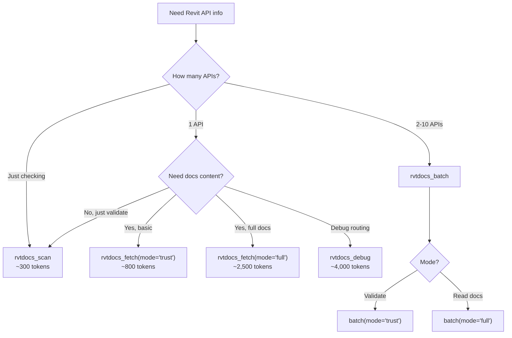

# Tools Reference

Per-tool documentation for all 9 rvtdocs-mcp tools.

## Tool Index

| Tool | Category | Avg Output Tokens | Doc |
|------|----------|-------------------|-----|
| [`rvtdocs_fetch`](./rvtdocs-fetch.md) | Core Fetch | 300-2,500 (by mode) | Single-query fetch with trust-gated output |
| [`rvtdocs_scan`](./rvtdocs-scan.md) | Core Fetch | ~300 | Lightweight existence check |
| [`rvtdocs_batch`](./rvtdocs-batch.md) | Core Fetch | ~4,000 (4 queries) | Concurrent multi-query fetch |
| [`rvtdocs_debug`](./rvtdocs-debug.md) | Core Fetch | ~4,000 | Diagnostic fetch with resolver trace |
| [`rvtdocs_stats`](./rvtdocs-stats.md) | Observability | ~500 | Usage metrics and top failures |
| [`rvtdocs_version_info`](./rvtdocs-version-info.md) | Observability | ~200 | Supported versions and recommendations |
| [`rvtdocs_schema`](./rvtdocs-schema.md) | Introspection | ~2,000 | JSON schemas for all tools |
| [`rvtdocs_session_set`](./rvtdocs-session.md) | Session | ~50 | Store key-value pair |
| [`rvtdocs_session_get`](./rvtdocs-session.md) | Session | ~100 | Retrieve stored value |

## Tool Selection Guide

