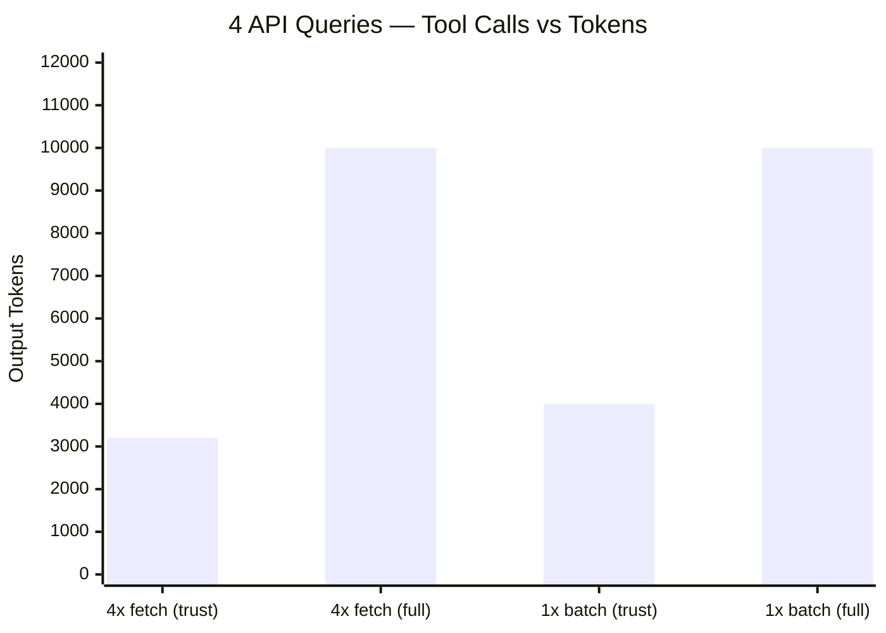
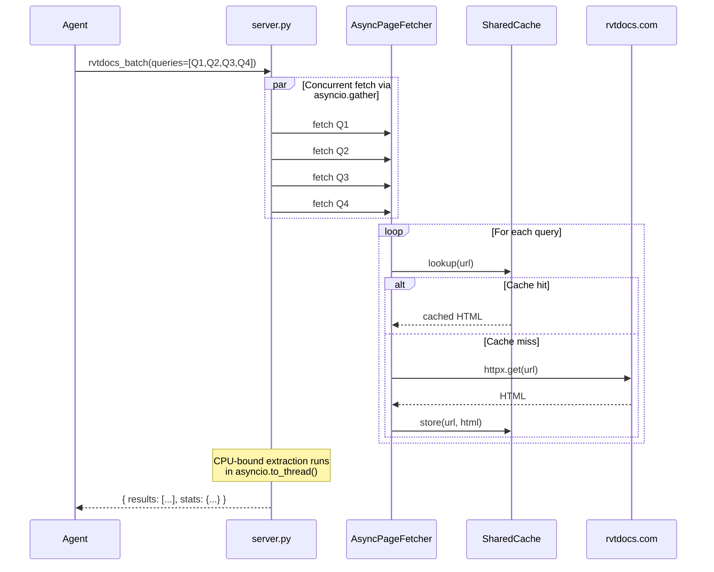

# rvtdocs_batch

Batch-fetch multiple API queries in a single tool call using async concurrent HTTP via `httpx`.

## Parameters

| Param | Type | Required | Default | Description |
|-------|------|----------|---------|-------------|
| `queries` | list[string] | Yes | — | Up to 10 API queries |
| `year` | string | No | `"2026"` | Revit version year (2022-2027) |
| `max_chars` | int | No | `12000` | Per-query snippet character limit |
| `mode` | string | No | `"trust"` | `trust` or `full` |

## Output Schema

```json
{
  "results": [
    {
      "success": true,
      "resolved": { "kind": "class", "path": "/2025/..." },
      "http": { "ok": true, "status": 200, "fromCache": false },
      "trust": { "verdict": "pass", "confidence": 0.90 },
      "sectionsFound": ["Methods", "Properties"]
    },
    { "...": "one entry per query" }
  ],
  "stats": {
    "totalQueries": 4,
    "successes": 4,
    "successRate": 1.0,
    "totalOutputChars": 16243
  }
}
```

## Performance Comparison



| Approach | Tool Calls | Latency | Output Tokens |
|----------|------------|---------|---------------|
| 4x `rvtdocs_fetch` (trust) | 4 | ~6s sequential | ~3,200 |
| 4x `rvtdocs_fetch` (full) | 4 | ~6s sequential | ~10,000 |
| **1x `rvtdocs_batch` (trust)** | **1** | **~2s concurrent** | **~4,000** |
| **1x `rvtdocs_batch` (full)** | **1** | **~2s concurrent** | **~10,000** |

**Batch advantages over sequential fetches:**
- **75% fewer tool calls** (1 vs 4)
- **67% faster** (~2s vs ~6s) due to concurrent HTTP
- **Aggregate stats** included for quick overview
- **Output budget** enforced at 50,000 chars total

## Internals



## When to Use

1. **Looking up related APIs** — e.g., all APIs needed for an ExtensibleStorage implementation
2. **API migration** — fetch same APIs for two different Revit versions
3. **Comprehensive validation** — check multiple APIs before coding
4. **Any time you need 2+ queries** — batch is always more efficient than sequential fetches

## Advantages

- **Single tool call** for up to 10 queries — reduces overhead and latency
- **Concurrent HTTP** via `httpx.AsyncClient` — all fetches run in parallel
- **Shared SQLite cache** — cached pages are served instantly across queries
- **Aggregate stats** — `successRate` and `totalOutputChars` give quick quality overview
- **CPU-bound work offloaded** — extraction runs in `asyncio.to_thread()` to avoid blocking the event loop

## Disadvantages

- **No `diagnostics` mode** — only `trust` and `full` supported
- **Output budget of 50,000 chars** — at scale, individual snippets may be truncated
- **All-or-nothing year** — cannot query different years for different queries in one call
- **Max 10 queries** — enforced limit to prevent abuse
