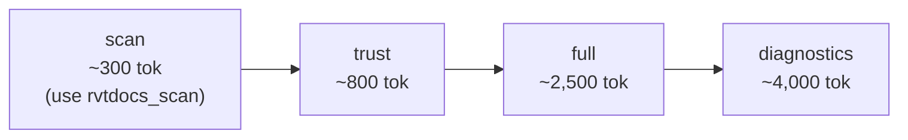

# rvtdocs_fetch

Primary tool for retrieving Revit API documentation with trust-gated output shaping.

## Parameters

| Param | Type | Required | Default | Description |
|-------|------|----------|---------|-------------|
| `query` | string | Yes | — | API query: `Wall`, `Wall.Create`, `Autodesk.Revit.DB.Wall` |
| `year` | string | No | `"2026"` | Revit version year (2022-2027) |
| `max_chars` | int | No | `12000` | Maximum snippet character count |
| `mode` | string | No | `"trust"` | Output detail level: `trust`, `full`, `diagnostics` |

## Modes



| Mode | Snippet | Evidence | TokenStats | Diagnostics | Use Case |
|------|---------|----------|------------|-------------|----------|
| `trust` | No | No | No | No | Code generation — metadata + confidence is enough |
| `full` | Yes | Yes | Yes | No | Need to read API docs (params, returns, remarks) |
| `diagnostics` | Yes | Yes | Yes | Yes | Debug routing or extraction issues |

## Output Schema

### `trust` mode (~800 tokens)

```json
{
  "success": true,
  "resolved": {
    "kind": "method",
    "path": "/2025/Autodesk.Revit.DB.Wall/Create"
  },
  "http": {
    "ok": true,
    "status": 200,
    "elapsedMs": 1200,
    "fromCache": false,
    "reasonCode": "single_fetch_success"
  },
  "trust": {
    "verdict": "pass",
    "confidence": 0.85,
    "reasonCode": "single_fetch_success"
  },
  "suggestions": null,
  "deprecation": null,
  "sectionsFound": ["Syntax", "Parameters", "Returns", "Remarks"]
}
```

### `full` mode (~2,500 tokens)

Same as `trust`, plus:

```json
{
  "extracted": {
    "snippet": "## Wall.Create\nCreates a new wall...\n\n## Parameters\n- document (Document): ...\n...",
    "focus": "method",
    "matched": true,
    "confidence": 0.85,
    "reasonCode": "single_fetch_success",
    "evidence": ["method_token", "class_token", "structured_parameters"],
    "tokenStats": { "snippetChars": 1847, "snippetSource": "structured" }
  }
}
```

### `diagnostics` mode (~4,000 tokens)

Same as `full`, plus:

```json
{
  "diagnostics": {
    "mode": "diagnostics",
    "inputQuery": "Wall.Create",
    "canonicalQuery": "Wall.Create",
    "canonicalRewritten": false,
    "resolution": {
      "kind": "method",
      "className": "Wall",
      "methodName": "Create",
      "unverifiedNamespace": false
    },
    "semantic": {
      "focus": "method",
      "matched": true,
      "confidence": 0.85,
      "evidence": ["method_token", "class_token"]
    }
  }
}
```

## Advantages

- **Trust-gate** lets the agent decide whether to read more, saving tokens on correct lookups
- **Structured extraction** returns section-aware markdown, not raw text
- **Suggestions on failure** provide actionable alternatives (e.g., "try `Element.DeleteEntity` instead")
- **Deprecation detection** warns about `[Obsolete]` APIs before the agent writes code
- **Version-specific** — agent passes `year` to get correct API surface for the target Revit version
- **SQLite cache** with 7-day TTL — second fetch for same API is <100ms

## Disadvantages

- **Sync I/O** — uses `urllib` blocking; for multiple queries, prefer `rvtdocs_batch`
- **Depends on rvtdocs.com HTML structure** — parser needs updates if site format changes
- **Cache cold start** — first fetch for a unique URL takes 1-2s
- **Not real-time** — cached docs may be slightly stale (7-day TTL for class/method)

## Token Cost Comparison

| Approach | This Query | 4 Queries |
|----------|-----------|-----------|
| WebSearch | ~4,000 tok | ~16,000 tok |
| rvtdocs_fetch (trust) | **~800 tok** | ~3,200 tok |
| rvtdocs_fetch (full) | **~2,500 tok** | ~10,000 tok |
| rvtdocs_batch (trust) | N/A | **~4,000 tok** |
