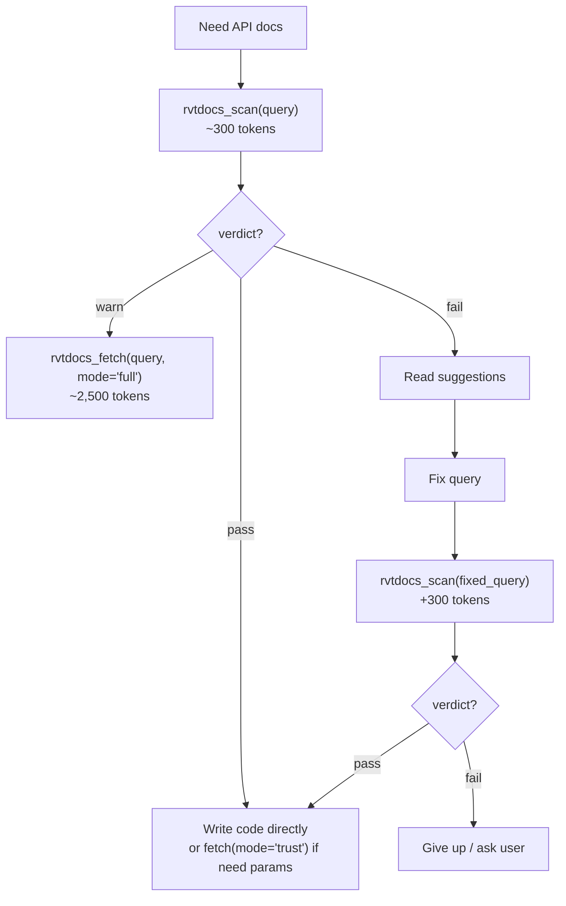

# rvtdocs_scan

Lightweight trust check with minimal token cost. Resolves a query, fetches the page, and returns only metadata — no snippet.

## Parameters

| Param | Type | Required | Default | Description |
|-------|------|----------|---------|-------------|
| `query` | string | Yes | — | API query to validate |
| `year` | string | No | `"2026"` | Revit version year (2022-2027) |
| `max_chars` | int | No | `12000` | Maximum chars (applies if snippet is ever included) |

## Output Schema (~300 tokens)

```json
{
  "success": true,
  "resolved": {
    "kind": "class",
    "path": "/2025/Autodesk.Revit.DB.Wall"
  },
  "http": {
    "ok": true,
    "status": 200,
    "elapsedMs": 850,
    "fromCache": true,
    "reasonCode": "single_fetch_success"
  },
  "trust": {
    "verdict": "pass",
    "confidence": 0.90,
    "reasonCode": "single_fetch_success"
  },
  "suggestions": null,
  "deprecation": null,
  "sectionsFound": ["Methods", "Properties", "Constructors"]
}
```

### Failed Scan Output

```json
{
  "success": false,
  "resolved": {
    "kind": "method",
    "path": "/2025/Autodesk.Revit.DB.Schema/EraseSchemaAndAllEntities"
  },
  "http": {
    "ok": true,
    "status": 200,
    "reasonCode": "api_not_found"
  },
  "trust": {
    "verdict": "fail",
    "confidence": 0.15,
    "reasonCode": "api_not_found"
  },
  "suggestions": {
    "message": "API not found on the resolved page.",
    "alternateQueries": ["Element.DeleteEntity", "Schema.EraseSchema"]
  },
  "error": "API not found"
}
```

## When to Use

1. **Validate API existence** before writing code
2. **Batch validation** — scan 10 APIs at ~3,000 tokens total vs 10 full fetches at ~25,000 tokens
3. **Gate decision** — scan result determines whether to fetch full docs or try a different API

## Agent Strategy: Scan-Then-Fetch



**Token savings vs direct fetch:**

| Scenario | Direct Fetch | Scan-Then-Fetch | Savings |
|----------|-------------|-----------------|---------|
| API correct | 2,500 tok | 300 tok (scan only) | **88%** |
| API correct, need params | 2,500 tok | 1,100 tok (scan + trust) | **56%** |
| API wrong, 1 correction | 5,000 tok | 1,400 tok | **72%** |

## Advantages

- **Lowest token cost** of all fetch tools (~300 tokens)
- **Same routing + fetch + trust** pipeline as `rvtdocs_fetch` — just no snippet
- **Suggestions on failure** — agent can self-correct without human intervention
- **Deprecation detection** — warns if API is marked `[Obsolete]`

## Disadvantages

- **No API documentation content** — only metadata. Must follow up with `rvtdocs_fetch` if details needed
- **Still performs full HTTP fetch** — latency is similar to `rvtdocs_fetch` (1-2s miss, <100ms hit)
- **Single query per call** — for 4+ APIs, `rvtdocs_batch` is more efficient
