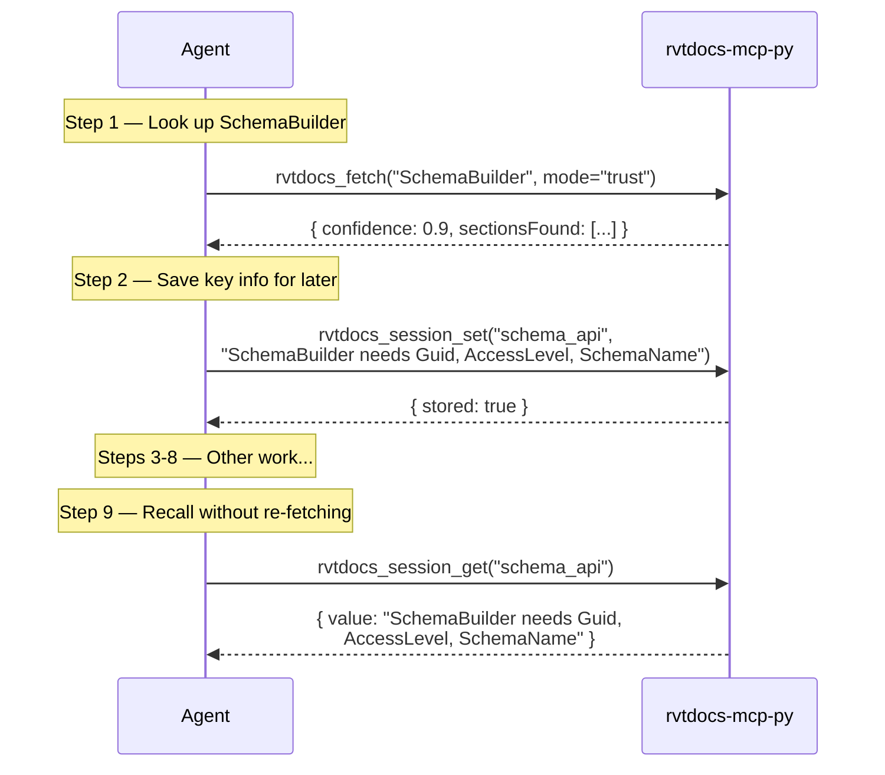

# rvtdocs_session_set / rvtdocs_session_get

Ephemeral in-memory key-value store for cross-tool session data.

## rvtdocs_session_set

### Parameters

| Param | Type | Required | Description |
|-------|------|----------|-------------|
| `key` | string | Yes | Storage key |
| `value` | string | Yes | Value to store |

### Output (~50 tokens)

```json
{ "stored": true, "key": "schema_guid" }
```

## rvtdocs_session_get

### Parameters

| Param | Type | Required | Description |
|-------|------|----------|-------------|
| `key` | string | Yes | Key to retrieve |

### Output (~100 tokens)

```json
{
  "found": true,
  "key": "schema_guid",
  "value": "12345678-abcd-...",
  "storedAt": "2025-07-14T10:30:00Z"
}
```

If key not found:

```json
{
  "found": false,
  "key": "nonexistent",
  "value": null
}
```

## When to Use

Agent is in a multi-step workflow and needs to recall earlier API lookup results without re-fetching.



**Token savings:** Session recall costs ~100 tokens vs re-fetch at ~800 tokens = **87% savings**.

## Advantages

- Near-zero token cost (~50 store, ~100 retrieve)
- Avoids redundant API lookups in long workflows
- No external dependencies — pure in-memory dict

## Disadvantages

- **Ephemeral** — data lost on server restart
- **No persistence** — cannot survive across sessions
- **String values only** — complex data must be serialized
- **No eviction** — unlimited growth during a session (acceptable for typical usage)
