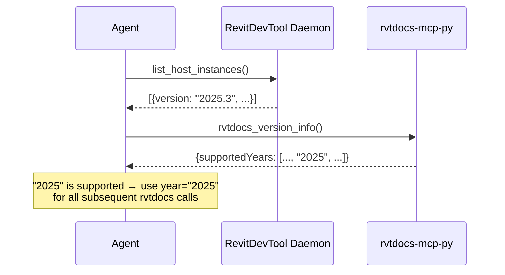

# rvtdocs_version_info

Returns metadata about supported Revit API documentation versions and server recommendations.

## Parameters

None.

## Output Schema (~200 tokens)

```json
{
  "supportedYears": ["2022", "2023", "2024", "2025", "2026", "2027"],
  "defaultYear": "2026",
  "recommendation": "Pass the Revit version from your host instance for best accuracy.",
  "acceptedRange": { "min": 2020, "max": 2030 },
  "currentServerVersion": "0.2"
}
```

## When to Use

1. **Version discovery** — agent reads `revit://version` from daemon, then confirms year is supported
2. **Year selection** — determine which year to pass to fetch/scan/batch tools
3. **Range validation** — check if a user-specified year is within the accepted range

## Agent Integration Pattern



## Advantages

- Minimal token cost (~200 tokens)
- Helps agent avoid year-related warnings
- Server version included for troubleshooting

## Disadvantages

- Static information — could be hardcoded in agent rules, but the tool ensures accuracy if supported years change
