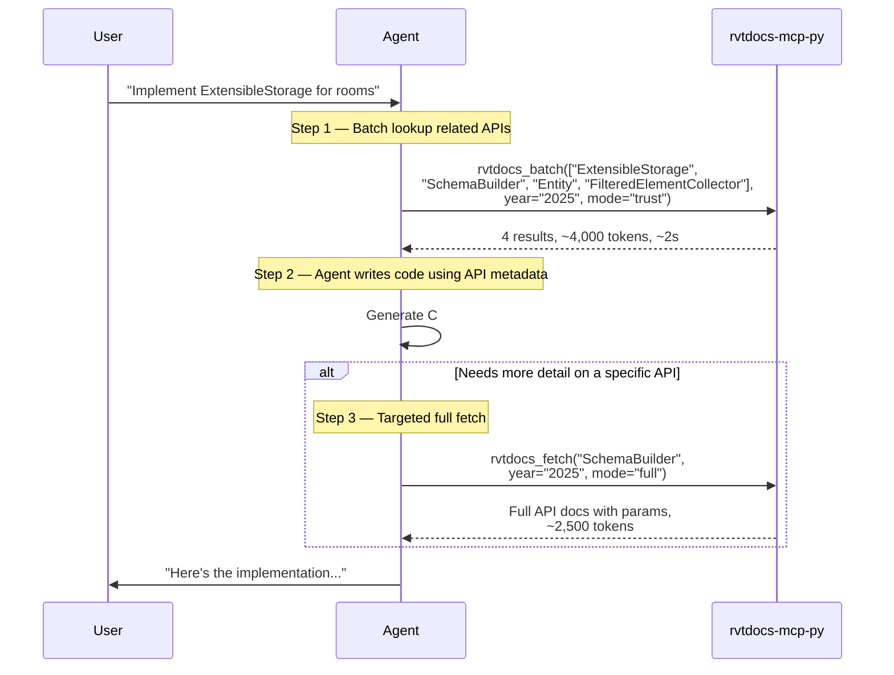
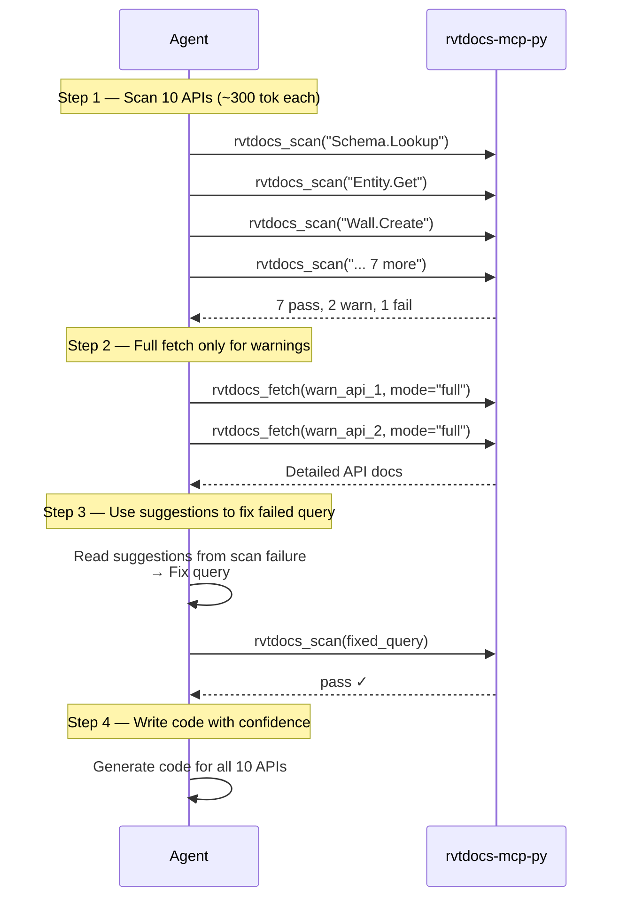
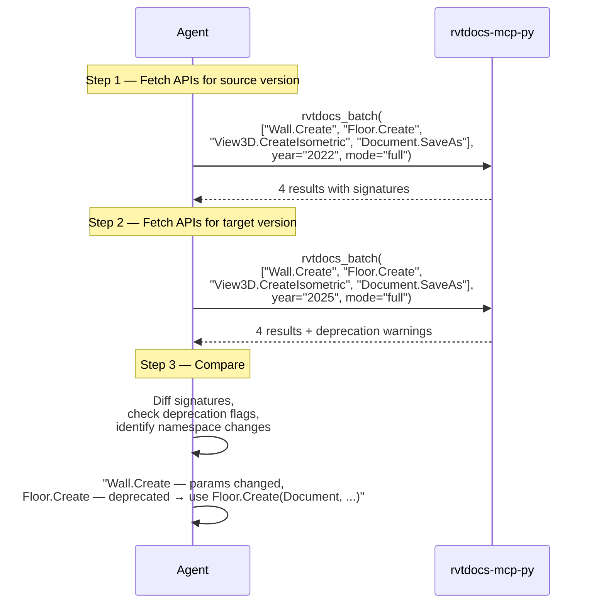
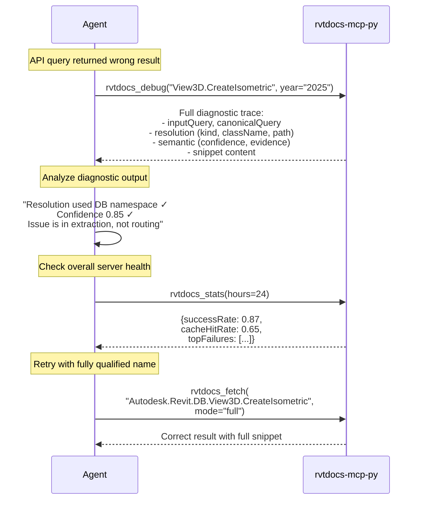
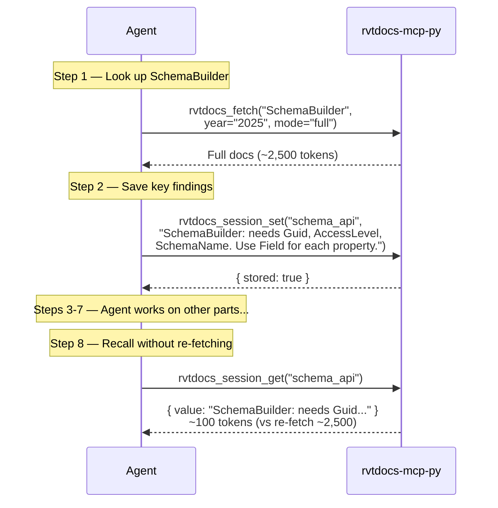
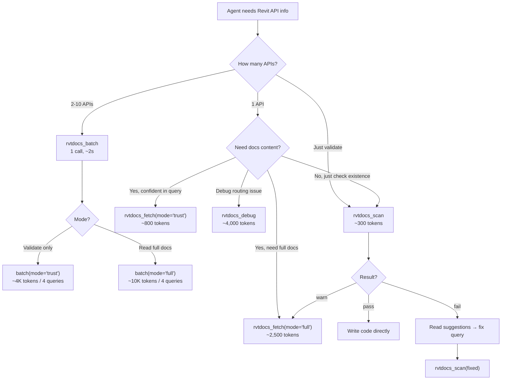

# Agent Workflows

How the 9 rvtdocs-mcp-py tools compose into multi-step agent workflows for Revit API development.

## Workflow 1 — Code Generation (Most Common)

Agent looks up related APIs before writing Revit code.

**Tools used:** `rvtdocs_batch` → (agent writes code) → `rvtdocs_fetch` (if error)

**Token budget:**

| Step | Tool | Tokens (output) |
|------|------|-----------------|
| 1 | `rvtdocs_batch` (4 queries, trust) | ~4,000 |
| 2 | Agent reasoning | 0 |
| 3 | `rvtdocs_fetch` (full, if needed) | ~2,500 |
| **Total (trust only)** | | **~4,000** |
| **Total (with 1 full fetch)** | | **~6,500** |

---

## Workflow 2 — Validate-First (Most Token-Efficient)

Agent validates API existence before committing to code. Best for uncertain or complex tasks.

**Tools used:** `rvtdocs_scan` (multiple) → `rvtdocs_fetch` (selective)

**Token budget:**

| Step | Tool | Tokens |
|------|------|--------|
| 1 | 10x `rvtdocs_scan` | ~3,000 |
| 2 | 2x `rvtdocs_fetch` (full) | ~5,000 |
| 3 | 1x `rvtdocs_scan` (retry) | ~300 |
| **Total** | | **~8,300** |
| **vs 10x full fetch** | | ~25,000 |
| **Savings** | | **67%** |

---

## Workflow 3 — API Migration (Cross-Version)

Agent compares API surfaces across Revit versions to detect breaking changes.

**Tools used:** `rvtdocs_batch` (year A) → `rvtdocs_batch` (year B) → diff

**Token budget:**

| Step | Tool | Tokens |
|------|------|--------|
| 1 | `rvtdocs_batch` (4 queries, full, 2022) | ~10,000 |
| 2 | `rvtdocs_batch` (4 queries, full, 2025) | ~10,000 |
| 3 | Agent reasoning | 0 |
| **Total** | | **~20,000** |

---

## Workflow 4 — Debug & Diagnostics

Agent encounters unexpected behavior. Uses debug tools to investigate routing and extraction.

**Tools used:** `rvtdocs_debug` → `rvtdocs_stats` → `rvtdocs_fetch` (corrected)

---

## Workflow 5 — Session Memory (Long Multi-Step Tasks)

Agent uses session store to remember earlier lookups across a multi-step task.

**Tools used:** `rvtdocs_fetch` → `rvtdocs_session_set` → (other work) → `rvtdocs_session_get`

**Token savings:** Session recall costs ~100 tokens vs re-fetch at ~2,500 tokens = **96% savings**.

---

## Workflow Selection Guide

## Token Budget Summary

| Workflow | Total Tokens | Tool Calls | Best For |
|----------|-------------|------------|----------|
| Code Generation (batch trust) | ~4,000 | 1 | Known APIs, code writing |
| Code Generation (with full fetch) | ~6,500 | 2 | Need param details |
| Validate-First (10 APIs) | ~8,300 | 13 | Uncertain APIs, complex tasks |
| API Migration (4 APIs × 2 years) | ~20,000 | 2 | Cross-version comparison |
| Session Memory | ~100 recall | 1 | Multi-step, avoid re-fetch |
| Debug Routing | ~4,000 | 1 | Wrong namespace / low confidence |
